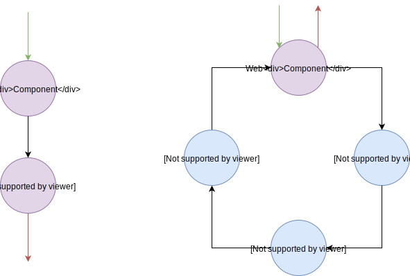

# Workflow
----
System's workflow describes the dataflow of the system. It describes where data comes in and where information goes out of
the system. By "where" I mean which component of the system. As mentioned before each **HellHound** [Component](./Components.md)
has an **input stream** and an **output stream** assigned to them. You can think of each component as a pipe, the whole
system as a pipeline. Data flows to this pipeline based on your piping (description) from entry points and exits the pipeline
from exit points. Pipeline might have more than one entry or exit points or none at all.

Using the system workflow you can design an open or a close dataflow for your system. A Close system is a type of system
which all of its components have their **input** and **output** connected. In the other hand, an open system is a type of
system which **NOT** all of the **inputs** and **outputs** of components connected to each other.

> :warning: **Important NOTE**: Don't confuse Input and Output of each component which components dependencies.

Components of a system should consum from their `INPUT` and produce their `OUTPUT` in non-blocking fashion in order to avoid
blocking in a system.

Check out the [workflow](./Workflow.md) section for more information.
