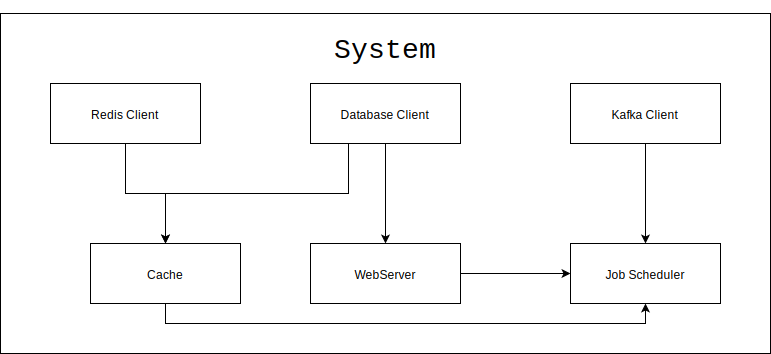

# Systems

## Overview
At heart, **HellHound** created around the idea of systems. The basic idea is to describe the execution model and
dataflow of a program using data and let **HellHound** handles the rest. Systems are the first of **HellHound**
which you need to learn about.

### Execution model
Systems composed by [**Components**](./Components.md). A system knows how to start and stop components. It is also
responsible for managing dependencies between theme. Components are the smallest parts of a system whic are reusable.

A **HellHound** system is basically a `map` describing different aspects of a program. Each program might have several
systems. For example a development system and a production system. But there would be just a system running at a given
time.

Systems should follow a certain spec (`:hellhound.system/system`). For example any system should have a`:components` key
with a vector as its value. All the `components`of the system should be defined under this key. Each component is a `map`
describing the behaviours of that component (For more info on components read [here](./Components.md)).

In order to use **HellHound** systems. First you need to define your system by defining a map with at least one key. Yupe,
you guessed it correctly, the `:components` key. We're going to discuss the system's keys in bit. So for now just let's
talk about how to start and stop a system.

After defining the system. The next step would be to set the defined system as the default system of your program by using
`hellhound.system/set-system!` function. This function accepts just one argument which is the system map. It basically
analayze the given map and set it as the default system of the program. From now on, you can call `hellhound.system/start`
and `hellhound.system/stop` function.

Basic execution flows of a system are `start` and `stop`. Both of them creates a graph from the system components and their
dependencies. Then they `start`/`stop` the system by walking through that graph and calling the `start-fn` and `stop-fn`
function of each component.

After starting a system, you can access the running system via `hellhound.system/system` function. It would returns a map
describing the current running system including all the running components.

There are two ways to manage dependencies in your components code. The first one via a the system map itself, by treating
the system map as a repository of dependencies. The second way is via dependency injection model which is not supported
at this version (`v1.0.0`). Anyway, any component can pull what ever it needs from the system map by calling
`hellhound.system/get-component` function and passing the component name to it. This function will simply look for the
component in system map and returns the running component map. There is a huge problem with this apparoach. By using this
apparoach components knows too much about the environment around them, so it reduce their portablity.

NOTE: In near future we're going to add the support for dependency injection to **HellHound** systems.

### Workflow
Each component shoud have one *INPUT* and *OUTPUT* which should be stream of values. Input should be passed
to the component `start-fn` using `context` map and oputput should be return as the value of `:output` key
in the component map.

## System's Structure

* `:hellhound.component/name`
The name of the component.
* `:hellhound.component/start-fn`
A *function* which is responsible to start the component. This function should accept two parameters.
The first one simply is the *component map itself* and the second one is *context map* which contains
some data to be used inside the component. For example *input* stream.

The *start-fn* basically *should return* the component map and attach any state necessary to it. Also
if the component has any *output* stream is should associate the ~:output~ with the *output* stream value.
* `:hellhound.component/stop-fn`
This function is responsible for stopping the component and it gets only one argument which is the *component map*
again and should return the stopped component map as the return value.
* `:hellhound.component/depends-on`
An array of component names which the current component is depends on.
